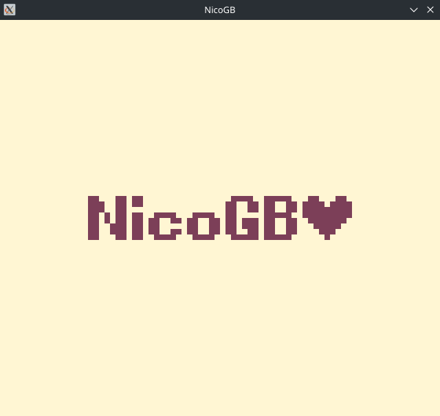
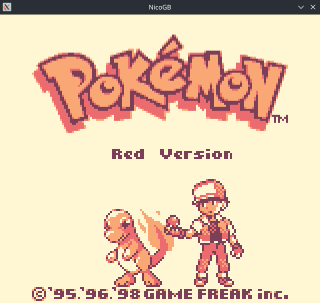
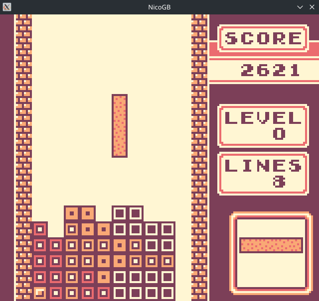
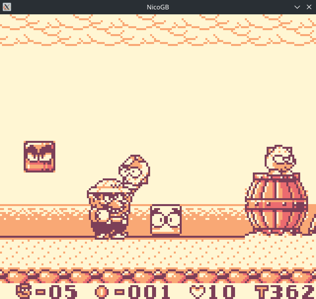
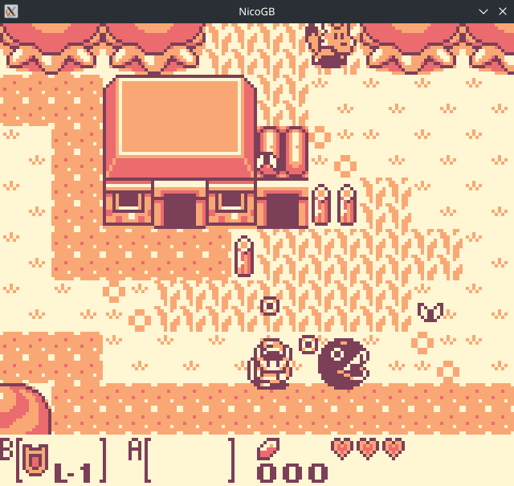
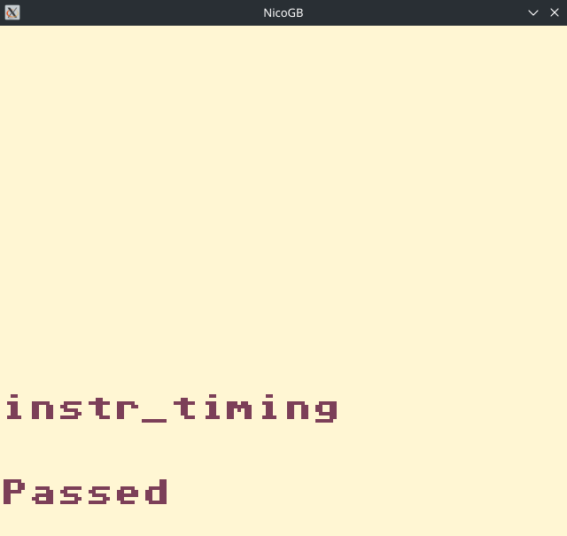
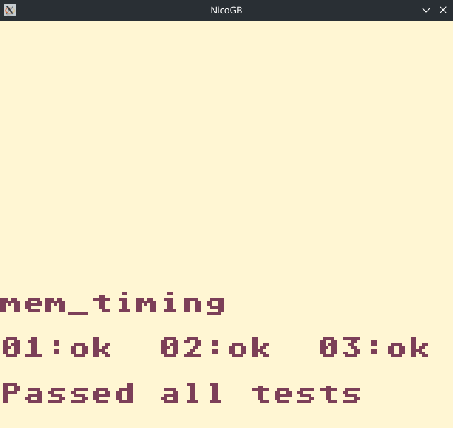

# NicoGB
A Game Boy emulator written in C++

| NicoGB                                   | Pokémon                                      | Tetris                                |
|------------------------------------------|----------------------------------------------|---------------------------------------|
|                |                  |             |

| Kirby                                    | Warioland                                    | Legend of Zelda                       |
|------------------------------------------|----------------------------------------------|---------------------------------------|
|                  |                  |     |

| CPU instructions                         | Instruction timing                           | Memory timing                         |
|------------------------------------------|----------------------------------------------|---------------------------------------|
|  |  |  |

# Controls
Drag and drop a file onto the window to run it

| Game Boy | Keyboard |
|----------|----------|
| Up       | Up       |
| Down     | Down     |
| Left     | Left     |
| Right    | Right    |
| A        | Z        |
| B        | X        |
| Start    | Enter    |
| Select   | Shift    |
| Quit     | Q        |
| Restart  | R        |
