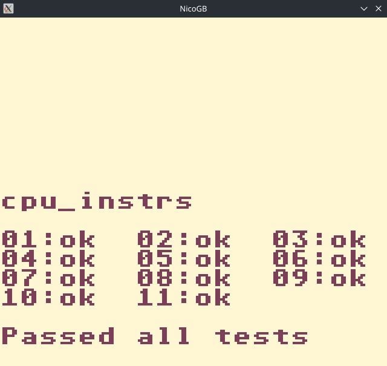

# NicoGB
A Game Boy emulator written in C++

| NicoGB                     | Pokémon                      | Tetris                     |
|----------------------------|------------------------------|----------------------------|
|  |  |  |

| Kirby                      | Warioland                    | Blargg's CPU test          |
|----------------------------|------------------------------|----------------------------|
|    |  |      |

# Controls
| Game Boy | Keyboard |
|----------|----------|
| Up       | Up       |
| Down     | Down     |
| Left     | Left     |
| Right    | Right    |
| A        | Z        |
| B        | X        |
| Start    | Enter    |
| Select   | R-Shift  |
